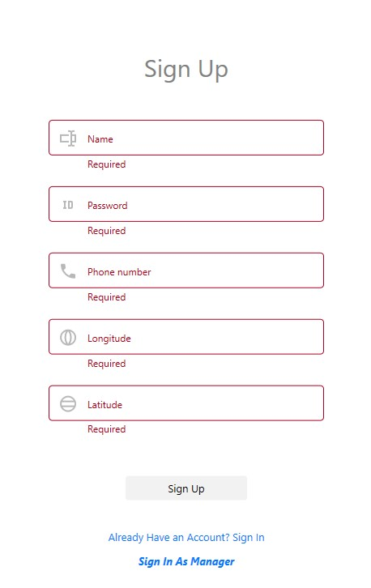
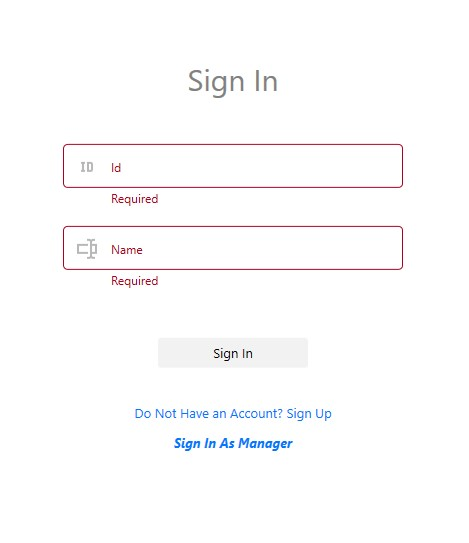
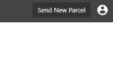
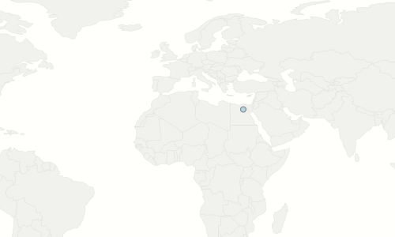
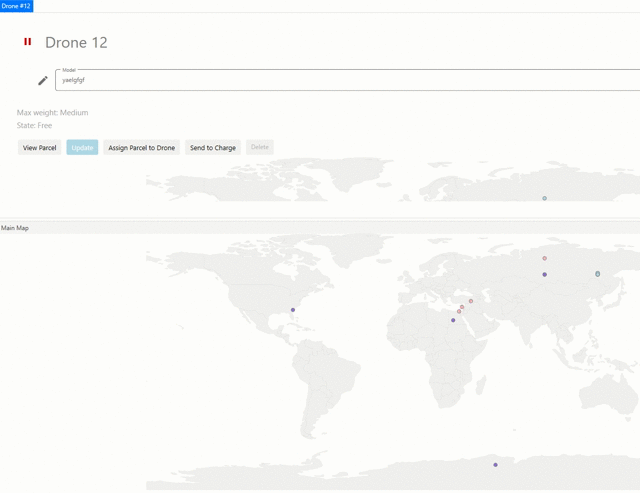
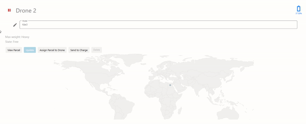

# dotNet5782_9171_7973

## TODO
- [ ] Add links to PL Bonuses
- [ ] DataSource - FIX ALL PROBLEMS
- [ ] document
- [ ] finish README.md
- [ ] check deletion
- [ ] Remove `Send A parcel` in manager mode
- [ ] Center the progress bar customer
- [ ] Tool bar blue
- [ ] Hide text above progress bar

## Bugs
- [X] Notify parcel changed in simulatr
- [X] Let customer name to include space
- [ ] Rewrite messages
- [ ] Add deletion message in context menu
  
## 
- [ ] Unseen drones
- [ ] View parcel in simulator

## Bonus Review

#### Singleton
We implemnt an abstract class `Singleton` which has lazy initialization and is thread-safe. The `Dal` and `BL` layers just inherit it.

### Dal

#### Structure
We have implemented the layers model in the second structure (The Bonus structur), So we have a config file which follos the given format:
```xml
<config>
    <dal>[chosen-dal]</dal>
    <dal-packages>
        <[package-1]>
            <class-name>[package-1-class-name]</class-name>
            <namespace>[package-1-namespace]</namespace>
        </[package-1]>
        ...
    </dal-packages>
</config>
```

This format allows to specify the namespace and not only the class name.

#### Logic Deletion
The dal deletion is just a *Logic Deletion* rather than *Real Deletion*. All the `Dal` entities implement the interface `IDeletable` which consists of just one property as follows
```csharp
interface IDeletable
{
    bool IsDeleted { get; set; }
}
```
From now, when *deletion* is just to change is `IsDeleted` property to `true`. Only non-deleted entities are allowed to perform actions.

#### Extensive Use of Generic
In order to prevent reapet our self according to the **DRY** rule, We implemnted all our `Dal` methods as generic methods. So, Instead of having `AddDrone`, `AddParcel`, `AddBaseStation` and `AddCustomer` for example, We only have `AddItem<T>` method.

### PL
#### User Interface
Our project supports two modes: customer mode and manager mode. When you run the program you see



You can press the `Sign In As Managar` and enter in manager mode or sign up for a new customer account and enter in customer mode. If you already have an account you can click on `Already Have an...` and get this scrren:



you can always change mode by clicking `Log Out`



#### MVVM
We used ***FULL*** MVVM.

#### Miscellaneous
- Triggres
  - Event Trigger [example](https://github.com/dasizis/dotNet5782_9171_7973/blob/fc27f43be178a083ddce056caffc8e1395295442/dotNet5782_9171_7973/PL/Views/Style/StyleDictionary.xaml#L126)
- Converters [example]()
- Commands (We implemented A [`RelyCommand`]() class and used it.) [example]()
- 

### Simulator

#### Location Update




#### Parallel Activation
You can activate as many drones as you want.

#### Busy Indicator


#### Maps
Each entity has it map to represent its location, Besides there is a `Main Map` for all the entities together.
